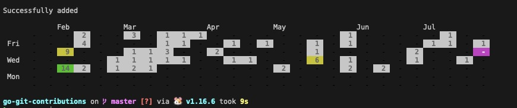
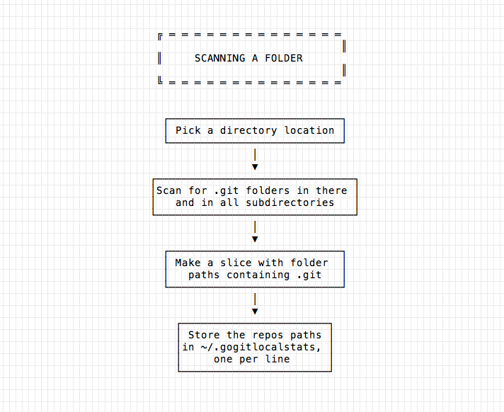
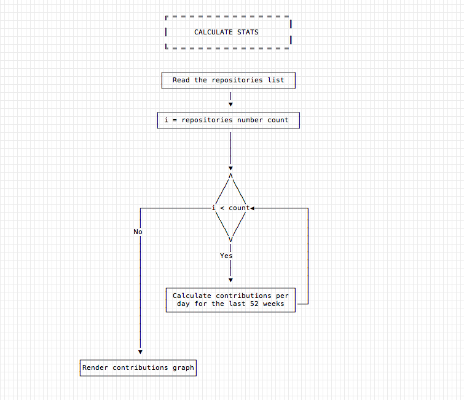

# go-git-contributions

CLI Tool to visualize your local Git contributions with Go

### How to use

- run `go build`
- run `go run main.go -add /some/path/in/your/directory -email your@email.com` 

### How it works?

